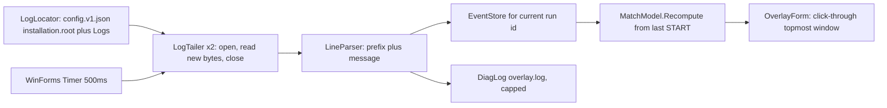
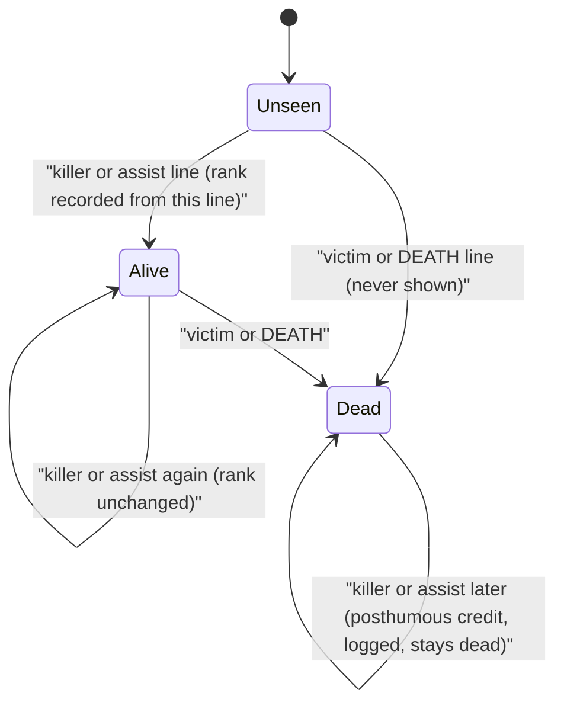

# ROTK alive overlay: build plan

The first implementation step is to copy this plan to `docs/BUILD_PLAN.md` in `C:\Users\Gabriel\Desktop\rotk-alive-overlay`, as the brief requires. Everything below was checked against the brief in [AGENT_PROMPT.md](AGENT_PROMPT.md) and against the live logs written on 27 September 2026 between 20:51 and 20:57 (client run id `1790534889`).

## 1. New facts found in the live logs (beyond the brief)

- **One order key across both files.** Within a client run, field 5 (the sequence number) and field 7 (a millisecond tick) are shared by both log files. `EVENT_START_MATCH` at 20:54:59 has sequence `12675`. The last kill of match 1 is `11568` and the first kill of match 2 is `13339`. The tick moves about 1000 per second: `455823048` at the start, then `455838399` fifteen seconds later. Because of this, same-second ties do not need to be guessed.
- **Dead players get credit after dying, and it happens often.** Dead ids reappear as assists: `Survivor63153485` (killed at seq 13430, assist at 13521), `Mike77`, `Kenskeyy`, `Pasen`, `_T4skFr`, `MYMOMMY` (killed at 13997, assist at 14010), and `GGEZZZ` (killed at 14486, assist at 14488). Dead ids also reappear as killers: `kayzahMACHINE` was killed at 14207 and then killed `tYt_DSN2tap` at 14222. This decides the resurrection rule (section 5).
- **Assist lines print a different rank decimal.** `GGEZZZ` shows 0.0 as a killer and 0.4 as an assist. `Survivor63153485` shows 0.0 and then 0.2. `MYMOMMY` shows 5.5 and then 5.3. The "first rank sticks" rule still applies, even when the first line was an assist line.
- **Ids are per match, not per account.** In the same client run, `Tottinho` was `13856340092514558465` in match 1 and `3650647432991908622` in match 2.
- **A stale kill-feed file from the previous run can sit on disk next to a fresh `MatchEndScreen.log`.** This is because `KillFeed.log` is only replaced at the first kill of a new run. The current `MatchEndScreen.log` was created at 20:51:56 and `KillFeed.log` at 20:52:13.
- **Encoding.** Both files are UTF-8 with no byte-order mark and CRLF line endings. The `MatchEndScreen.log` messages are only `HandleMatchPlayerSummaryPacket. InputFlags: 0x..` (89 lines), `EVENT_START_MATCH` (2), and `HandleMatchStargetPacket` (2).
- **Display.** The monitor is a 27-inch 2560x1440 panel, and the game runs in exclusive fullscreen at 1920x1440, which is 4:3 at the panel's full height.

## 2. Language and runtime

**Decision: C# 5 WinForms on .NET Framework 4.8.1, compiled by `C:\Windows\Microsoft.NET\Framework64\v4.0.30319\csc.exe`.**

The runtime (release 533325) and the compiler are already on this PC, so nothing needs to be installed. The output is a single portable `.exe` of roughly 50 KB. It should start in well under a second and use about 15 to 25 MB of memory. Idle CPU is effectively zero: one timer tick every 500 ms that opens two small files.

The implementer must stay within C# 5, the highest version this `csc.exe` supports. That means no `$""` string interpolation, no `?.`, no tuples, and no expression-bodied members.

Rejected options and the cost each would add:

- **Electron, Tauri, or WebView2:** a bundled browser engine and more than 100 MB of memory for a list of names.
- **.NET 8, WPF, or WinUI:** the SDK is not installed, and WPF adds GPU composition and slower startup for no benefit here.
- **Python or Node GUIs:** `python` is only the Microsoft Store stub, and Node would need Electron to show a window.
- **Rust, Go, or C++:** no toolchain is installed, and MSVC Build Tools is a multi-GB install.
- **FileSystemWatcher as the only trigger:** it is unreliable for files that another process keeps open while appending, and the Logs folder has about 50 other logs changing constantly. A plain timer is used instead (section 4).

## 3. Architecture



Planned files:

- `build.cmd` compiles `dist\RotkAliveOverlay.exe` (a window app) and `dist\checks.exe` (a console app) using `/r:System.Windows.Forms.dll /r:System.Drawing.dll /r:System.Web.Extensions.dll /win32manifest:app.manifest`.
- `app.manifest` declares `asInvoker` (no admin rights) and per-monitor DPI awareness.
- `src/Core/`: `LogLocator.cs`, `LogTailer.cs`, `LineParser.cs`, `MatchModel.cs`, `DiagLog.cs`. This code has no UI dependency, so the checks can use it.
- `src/App/`: `Program.cs` (single instance via a named mutex), `OverlayForm.cs`, `Settings.cs` (reads an optional `overlay.ini` next to the exe).
- `tests/Checks.cs` plus `tests/Fixtures.cs`. The fixture lines are embedded in code, because the live logs are overwritten at every client launch.
- `.gitignore` excludes `dist/`.

## 4. Reading the files

- **Finding the log folder.** Check these in order and use the first one that exists: `overlay.ini` `LogDir=`, then `installation.root` from `%APPDATA%\ROTK Launcher\config.v1.json`, then `config.v1.backup.json` (both parsed with `JavaScriptSerializer`), then `C:\Games\ROTK`. The overlay appends `\Logs`. If none exist, it retries every 30 s and shows "Log folder not found: path". The AppData `Logging:Directory` from the launcher command line is unverified and is not used.
- **Opening without blocking the game.** Each tick, each file is opened, the new bytes are read, and the file is closed immediately:

```csharp
new FileStream(path, FileMode.Open, FileAccess.Read, FileShare.ReadWrite | FileShare.Delete, 4096)
```

  The handle is never held between ticks, so the game can still append to, replace, or delete the file. The overlay never writes, renames, or truncates it.
- **Missing file.** `FileNotFoundException` or `DirectoryNotFoundException` means the file is absent. That is a normal state, not an error. A sharing violation or other `IOException` is retried on the next tick and logged once.
- **Detecting replacement.** For each file, remember the volume serial and file index (from `GetFileInformationByHandle` on the overlay's own handle), the byte offset, and a hash of the first 256 bytes. If any of these changed, or the length is smaller than the offset, treat the file as replaced. Drop that file's events and read it again from byte 0.
- **Torn last line.** New bytes are split only at `\n` (0x0A). Anything after the last newline stays in a byte buffer and is decoded once the rest arrives. A line is never parsed without its newline. Decoding happens per complete line, so a multi-byte `é` split across two reads is not corrupted.
- **Timing.** A single 500 ms `System.Windows.Forms.Timer` drives everything. The game's writes land on disk within about one second, so worst-case latency is about 1.5 s. A slow tick can never skip a line because reading is offset-based. There is no spin loop.

## 5. Parsing rules

**Prefix.** Split the line on tabs into at most 8 fields and trim the trailing `\r`. The fields are: date, time, host (ignored, because it can be `[HOST]` or `DESKTOP-0SJTF3G`), `runId` (field 4), `seq` (field 5), level (ignored), `tick` (field 7), and message (field 8). If there are fewer than 8 fields, or the numbers do not parse, the line goes to the diagnostics log as unparseable and is skipped.

**Player token.** Anchored to the tail, which works for any name including spaces, dots, digits, and non-ASCII characters:

```
(?<name>.+?) \((?<id>\d+)\) \[rank:(?<rank>\d+(?:\.\d+)?)\] \[ping:(?<ping>-?\d+)\]
```

The identity key is `id`, stored as a string. The name is only for display. Nothing is split on whitespace.

**Message shapes.** Each is a full-match regex built from the player token `P`:

- `^DEATH P$` is a death.
- `^P(?: \(ASSIST P\))? KILLED P(?: HEADSHOT)?$` is a kill with zero or one assist. `HEADSHOT` is accepted and ignored.
- A `MatchEndScreen.log` message that equals `EVENT_START_MATCH` is a match start.
- `HandleMatchStargetPacket` and `HandleMatchPlayerSummaryPacket...` are ignored silently. They are expected noise, not errors.
- **Unknown kill-feed shapes**, including a line with two or more `(ASSIST` groups:
  - If the line still ends with ` KILLED P( HEADSHOT)?` or starts with `DEATH P`, apply only the victim's death. Removing a dead player is always safe.
  - Nobody from an unknown line is added as alive.
  - The line is logged, and the header's `unparsed` counter goes up.
  - No second-assist grammar is invented.

## 6. Ordering and the match state machine

The overlay keeps every parsed event for the current run in memory. That is a few thousand small records at most. After any tick that adds events, it recomputes the list from scratch instead of updating it incrementally. The cost is trivial, and this removes a whole class of bugs: overlay launched mid-match, events arriving out of order between the two files, and file replacement all go through the same code path.

- **Current run.** The run id of the most recently written line across both files. Events with any other run id are ignored. This is what keeps a stale `KillFeed.log` from the previous launch from leaking in.
- **Order.** Sort by `seq` (shared across files within a run). If two events have the same `seq`, use the file's line number. If `seq` is missing, fall back to (date, time), with the match start ordered before a kill in the same second. Match transitions take minutes, so a kill in the same second as a start belongs to the new match.
- **Recompute.** Find the last `EVENT_START_MATCH`. If there is none, the state is "Waiting for match start". Otherwise, walk the events after it in order:



- **First rank sticks.** A player's rank is set only the first time their id appears in the match, whatever role that line had.
- **Resurrection rule.** Once an id is dead in the current match, it stays dead. Battle royale has no respawn, and this session's log shows dead ids credited as assists seven times and as a killer once, so a later killer or assist line is posthumous credit, not a return. Each case is written to `overlay.log` as `posthumous`, so nothing is dropped silently.
- **Reset.** Only `EVENT_START_MATCH` clears the list. A quiet gap never does.

## 7. Window behavior

- **Window type.**
  - Borderless `Form` with `TopMost`, `ShowInTaskbar = false`, `ShowWithoutActivation = true`.
  - Extended styles `WS_EX_LAYERED | WS_EX_TRANSPARENT | WS_EX_TOOLWINDOW | WS_EX_NOACTIVATE`. The window never takes a mouse click, never takes keyboard focus, and never shows in Alt+Tab.
  - Every 2 s it calls `SetWindowPos(HWND_TOPMOST, SWP_NOMOVE|SWP_NOSIZE|SWP_NOACTIVATE)` to stay on top after the game's mode switches. This only touches the overlay's own window.
- **Controls, none of them needed during a fight.**
  - A tray icon (`NotifyIcon`) with Show/Hide, Move mode, Open overlay.log, and Exit.
  - `RegisterHotKey` shortcuts: Ctrl+Alt+O shows or hides the overlay, Ctrl+Alt+M toggles move mode, Ctrl+Alt+Q quits.
  - Move mode temporarily removes `WS_EX_TRANSPARENT`, lets you drag the window, and saves the position to `overlay.ini`.
- **Independent of the game's resolution (user requirement).** The overlay never reads the game's resolution, its ini files, or its window. It never asks the user to change resolution, and it has no per-resolution presets. Every size and position comes from the monitor's current screen bounds at the moment it draws:
  - Position is stored in `overlay.ini` as an anchor corner plus fractions of screen width and height, e.g. `Anchor=TopLeft`, `X=0.006`, `Y=0.25`. Move mode saves fractions, never pixels.
  - Font size, row height, padding, and maximum width are multiples of the screen height. The default font is 1.1% of the screen height, which is about 16 px at 1440. The maximum width is 11% of the screen height, which is about 160 px, so text never stretches because the screen gets wider.
  - On `SystemEvents.DisplaySettingsChanged` (fired when the game's exclusive fullscreen switches the desktop from 2560x1440 to 1920x1440 and back), it recomputes the layout from `Screen.PrimaryScreen.Bounds` and repaints. The game can therefore run at 1920x1440, 2560x1440, 1920x1080, or anything else, and the overlay stays in the same relative spot at the same relative size.
  - One limit that software outside the game cannot remove: if the monitor or GPU stretches a 4:3 image across the 16:9 panel, everything on screen, including the overlay, is stretched sideways by the same factor. The overlay's height-based sizing keeps text legible in that case.
- **Fullscreen visibility.** A normal window cannot be forced above a true exclusive-fullscreen swap chain without hooking DirectX, and hooking is out of scope. Visibility depends on the game's display mode, not its resolution:
  - On Windows 10 19045, Fullscreen Optimizations often run "exclusive" DX9/DX11 games through DWM, and then a topmost window does show. This is not guaranteed.
  - **Acceptance test.** Run a match in the current exclusive mode. If the overlay is visible, change nothing.
  - **If it is hidden or flickers:** switch the game's display mode to Windowed Fullscreen (borderless). This is the only change the plan may ask for, and it does not touch the resolution. To keep the 4:3 look in borderless, the user can optionally set the desktop to 1920x1440 with GPU scaling. The overlay works either way, because it follows whatever the screen bounds are.
  - The overlay contains no code that fights the game for the screen.
- **Density.**
  - Rank uses Consolas and names use Segoe UI (so non-ASCII names render), both at the height-relative size above. Rows are about 1.3 times the font height.
  - Background is dark at 80% opacity, and the window width fits the longest name up to the height-relative maximum.
- **Long and short lists.**
  - Rows are sorted by rank, highest first, then by first-seen order.
  - At most 15 rows are shown (configurable), followed by `+N more (<= X.X)`. The hidden rows are always the lowest ranks.
  - Late game, a single row still carries the full header.
- **Making high ranks obvious.**
  - The header always shows the strongest revealed player alive, e.g. `ALIVE 23 | TOP 7.5 Vara`.
  - Rank 7.0 and above shows in gold and bold, 6.0 to 6.9 in orange, other ranks in white, and 0.0 in grey but still listed. The thresholds are set in `overlay.ini`.
  - Ranks are not turned into medal names.
- **What the header shows in each state.**
  - Log folder missing: `Log folder not found: C:\Games\ROTK\Logs`
  - Before any match start in the current run: `Waiting for match start`
  - Match started, no kills yet: `Match started 20:54:59 | nobody revealed yet`
  - Active: the count, the top player, and `last event 12s ago`
  - **Stale:** after 5 minutes (configurable) with no new line in either file, the list turns grey and reads `STALE | last event 20:57:33`. This covers the game being closed, frozen, or the path being wrong. The overlay does not look at the game process to decide.
- **Rendering.** Custom `OnPaint` with double buffering. It repaints only when the state changes, plus once every 5 s to update the "last event" age text.

## 8. Start, stop, diagnostics

- **Start:** double-click `dist\RotkAliveOverlay.exe`, or a desktop shortcut to it. There is no installer and nothing runs at boot unless you add it to Startup yourself. A second launch just exits.
- **Stop:** tray Exit or Ctrl+Alt+Q.
- **Diagnostics:** `overlay.log` next to the exe, capped at 256 KB with one rollover. It records unparsed lines, posthumous events, file replacements, run-id changes, and match resets. The overlay never shows a dialog. Exceptions are caught at the timer boundary, logged, and shown as `!` in the header.

## 9. Coverage of the brief's 25 caveats

1. Identity is the id, never the name.
2. Rank is recorded once per id per match.
3. Victim and `DEATH` lines mean dead, killer and assist lines mean alive, as in the section 6 state machine.
4. Zero or one assist is parsed. Unknown lines only apply the victim's death and are counted.
5. Parsing is anchored to the tail of each player token, never split on whitespace.
6. The host field is ignored.
7. The list is recomputed from the last start, which also makes a mid-match launch correct.
8. File identity and length checks trigger a full re-read, and events from other run ids are dropped.
9. A missing file is a normal state.
10. The file is opened with `ReadWrite|Delete` sharing for each read, then closed.
11. Bytes after the last newline are held back until the line completes.
12. Events are ordered by the shared `seq` field, with a time fallback that puts a start first.
13. Only `EVENT_START_MATCH` resets the list.
14. `HandleMatchPlayerSummaryPacket` lines are ignored silently.
15. `HandleMatchStargetPacket` is ignored and is not a start.
16. Fullscreen is handled by the acceptance test, with a switch to borderless display mode as the fallback. The overlay's layout is relative to the screen, so it does not depend on the game's resolution.
17. The window is click-through, never takes focus, and uses the tray and hotkeys.
18. The list is capped at 15 rows with a `+N more` footer, and the top player is always in the header.
19. Rank 0.0 is shown in grey and never treated as unknown.
20. Ids change per match, which the live data confirms, and the reset relies on the start line.
21. Dead is sticky, and later credit is logged as posthumous.
22. The local player gets no special treatment.
23. The overlay only reads the game's logs. It never writes, locks, or rotates them.
24. Two small file opens every 500 ms and no hooks.
25. The stale state is shown explicitly.

Two further caveats were found in the live logs:

- Assist lines print a different rank decimal. Because first-seen wins, the displayed rank can come from an assist line.
- An assist who died without their death being printed would stay listed. This cannot be fixed from the logs.

## 10. Check lines (embedded in `tests/Fixtures.cs`)

`checks.exe` feeds these through the parser and the match model and asserts the results. `checks.exe replay <LogsDir>` prints the current alive list from real files so it can be compared by eye.

- **Kill:** `theCITYisRED (3497557662702907908) [rank:5.3] ... KILLED Cyb (5619943147552144769) ...`. The killer is alive at 5.3 and Cyb is not listed.
- **Headshot:** `Screedy ... KILLED Karspin ... HEADSHOT`
- **Assist:** `Lekid ... (ASSIST Horizon_ (14461580563613653473) [rank:5.3] [ping:3]) KILLED Hostyle ...`. Both Lekid and Horizon_ are alive.
- **DEATH:** `DEATH KingDady (12808836654268928371) [rank:5.3] [ping:3]`. KingDady is never listed.
- **Spaced and non-ASCII names:** `Sous 3x Filtré (13001428296672168345) [rank:4.4] ... KILLED possaki154 ...` and `BARA NO STOP (422556523889196780) [rank:5.2] ...`
- **Posthumous assist:** seq 13430 `daqzz KILLED Survivor63153485`, then seq 13521 `BARA NO STOP (ASSIST Survivor63153485 ... [rank:0.2]) KILLED daqzz`. Survivor63153485 stays dead, and daqzz is dead.
- **Posthumous kill:** seq 14207 `tYt_DSN2tap KILLED kayzahMACHINE`, then seq 14222 `kayzahMACHINE KILLED tYt_DSN2tap`. Both end up dead.
- **Second match start:** match 1 kills at seq 11560, 11562, and 11568, then `MatchEndScreen.log` seq 12675 `EVENT_START_MATCH` at 20:54:59. `N4KL`, `leodakappa`, and `lIlIlIlIlIlIlIlIlIlI` must disappear.
- **Same name, different id:** `Tottinho` `13856340092514558465` and `3650647432991908622` are two different players, and both are victims only, so neither is listed.
- **First rank sticks:** a synthetic pair in the real format, with the killer at 5.3 and then the same id as an assist at 5.2. Expect 5.3.
- **Torn line:** feed half of a kill line, then the rest. The first half must produce nothing.
- **Replacement:** truncate the fixture file to a shorter one with a new run id. State resets.
- **Stale kill feed:** `KillFeed.log` with run id A plus `MatchEndScreen.log` with run id B and a start. The list is empty.

## 11. What will not be built

- Reading game memory, opening `H1Z1.exe`, DLL injection, DirectX or overlay hooks, packet capture, or any stealth, hiding, or anti-detection mode.
- Changing `FileLogLevel` or any game or launcher setting.
- Positions, health, inventory, or any fact not in these two logs.
- Ping, weapon, headshot, XP, or damage display, a copy-paste box, scraping of the on-screen console, or medal names for ranks.
- A "this is you" marker, an installer, auto-start, network access, or telemetry.
